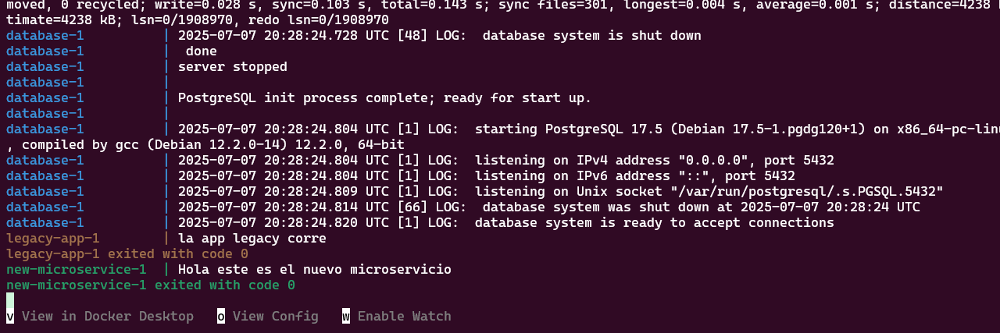
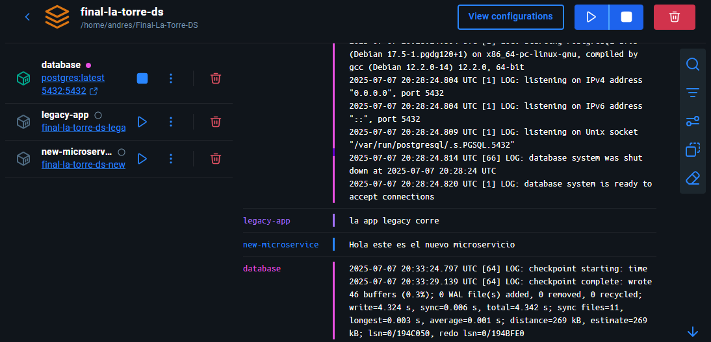

# Examen Final Proyecto 3 

Alumno : La Torre Vasquez Andres 
Codigo : 20212100C 

### Parte 1: Cotenerizacion y orquestacion local 

***Para app legacy :***
- dockerfile con compilacion multi-etapa
- instalar dependencias en docker actualmente solo puse que instale request en requirements.
- copiar archivos necesarios al entorno de ejecucion usando imagen base python:3.9-slim
- excluir archivos temporales y __pychache__ (use un .dockerignore aunque aunque no se va a crear archivos temporales por el momento)

***Para microservicio en python :***
- Usar dockerfile multi-etapa que compila el binario estaticamente
- empaqueta binario en una imagen minima (scratch) sin nada adicional para garantizar seguridad y bajo tamaño
- imagen ejecutable y liviana


***Para el docker compose:***

- Creamos los 3 servicios legacy-app, new-microservicio y database que se comunican de manera interna mediante.
    ```bash
    networks: 
        - internal 
    ```
- Legacy-app depende de que se cree correctamente database y el new-microservice igualmente depende de database y legacy-app para seguir con el flujo requerido
    ```bash 
        depends on:
            - database
    ```

- Actualmente el init.sql esta vacio porque no tengo claro los requerimientos de las tablas 

## Para levantar el docker-compose usamos 

```bash 
# en la raiz del proyecto usamos
docker-compose up --build
# Para mostrar el contenedor 
docker ps
```





"Declaro que esta entrega fue realizada de forma individual sin asistencia externa de generacion automatica y cumpliendo con las reglas del examen."